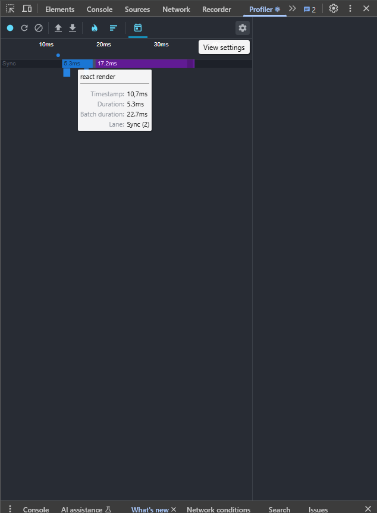
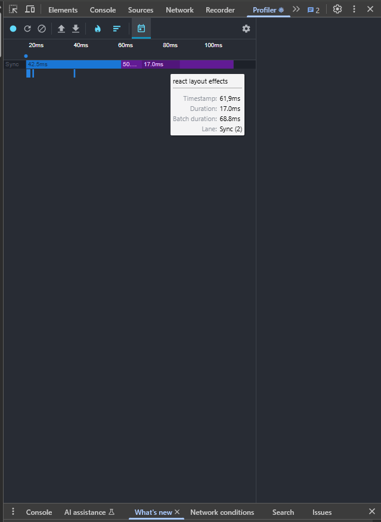

# React

Performance of my application

I set Asia region and check performance then I removed this one and check perfomrmance of my application again when show all the regions

# set Asia

### Commit without optimisation

### Commit with optimisation

### Render without optimisation

### Render with optimisation

### Flame Graph without optimisation

### Flame Graph with optimisation

### Ranked chat without optimisation

### Ranked chat with optimisation

# remove Asia (show all)

### Commit without optimisation

### Commit with optimisation

### Render without optimisation

### Render with optimisation

### Flame Graph without optimisation

### Flame Graph with optimisation

### Ranked chat without optimisation

### Ranked chat with optimisation

### React Layout Effects without optimisation

### React Layout Effects with optimisation

